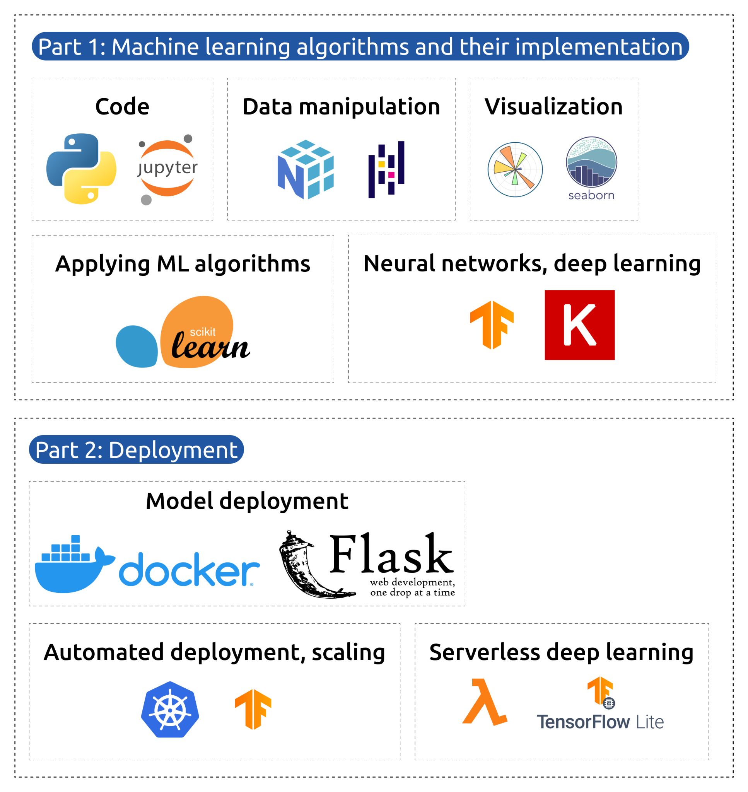

# Machine Learning Zoomcamp Cohort of 2024

This is my repository for ML-Zoomcamp.

## Table of Contents

- [Machine Learning Zoomcamp Cohort of 2024](#machine-learning-zoomcamp-cohort-of-2024)
  - [Table of Contents](#table-of-contents)
  - [Introduction](#introduction)
  - [Course Registration](#course-registration)
  - [Projects](#projects)

## Introduction

This course is perfect for those who want to understand the fundamentals of machine learning and learn to use the main ML frameworks and tools. The only requirement for this course is prior programming experience (1+ year) and familiarity with the command line.

You don’t need any prior knowledge of machine learning as we’ll guide you from the very basics to advanced topics. The course is divided into two parts:

- **Part 1:** covers machine learning algorithms implemented in Python, including Linear Regression, Classification, Decision Trees, Ensemble Learning, and Neural Networks.
- **Part 2:** focuses on deploying models using popular frameworks like Flask, TensorFlow, and Kubernetes.

## Course Registration

* Register at [DataTalks.Club](https://DataTalks.Club) and join the `#course-ml-zoomcamp` channel.
* [Course Telegram channel](https://t.me/mlzoomcamp)
* [Course YouTube playlist](https://www.youtube.com/playlist?list=PL3MmuxUbc_hIhxl5Ji8t4O6lPAOpHaCLR)

## Projects

My midterm project can be found here: [Premier League Football Prediction](https://github.com/RuiFSP/mlzoomcamp2024-midterm-project)  
My final project can be found here: [Final Project](https://github.com/RuiFSP/mlzoomcamp2024-final-project)